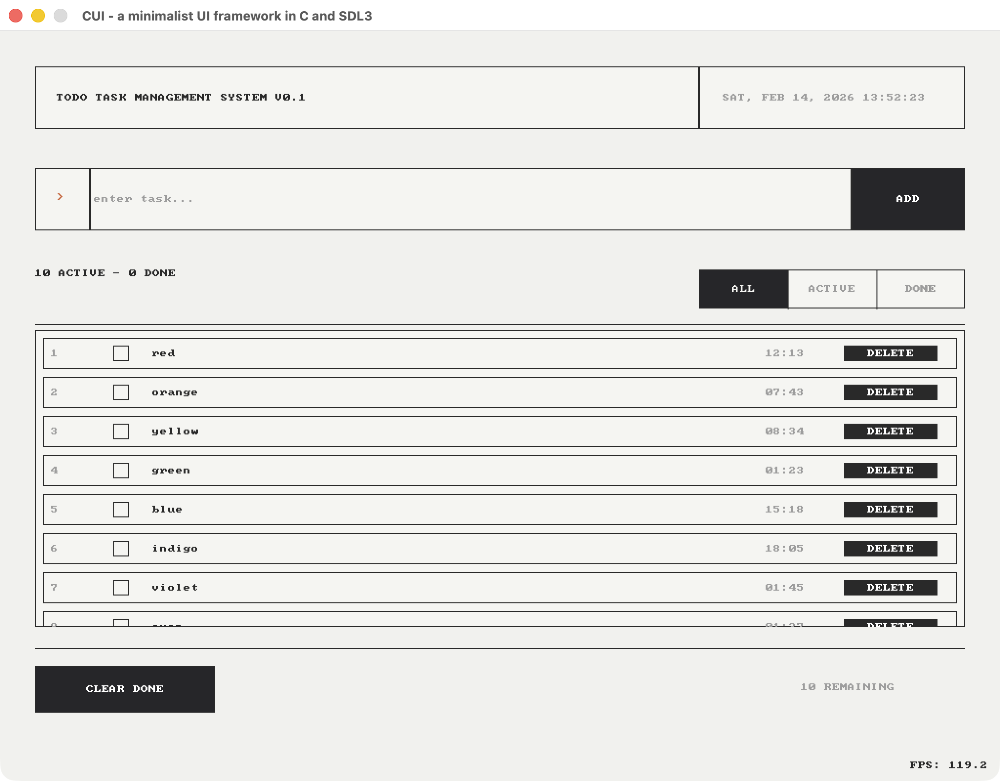

[](https://github.com/akurilin/cui/actions/workflows/ci.yml)
[](https://deepwiki.com/akurilin/cui)

# Project description

This project attempts to create a UI system built entirely in the C language and leveraging SDL, targeting specifically macOS. It's a learning project to master the fundamentals of UI building and the C language starting from the low level, letting SDL take care of some of the foundations, but taking over the rest of it.

## Current UI

Captured on February 14, 2026 from the current `main` page:



SDL and SDL_image are brought in as Git submodules at `vendored/SDL` and
`vendored/SDL_image`.

## Architecture Overview

The app is split into a small application shell (`main.c`), a page layer (`include/pages`, `src/pages`), and a reusable UI layer (`include/ui`, `src/ui`).

- `main.c` is composition/root wiring only: create window/renderer, initialize `ui_context`, create the active page, and run the main loop.
- `todo_page` owns todo-specific model state and UI composition for the current screen.
- `ui_context` is the lifecycle owner + dispatcher for all elements.
- `ui_element` is the common base interface for polymorphism in C.

### UI "Inheritance" Model (C-style)

There is no language-level inheritance in C, so this project uses struct embedding + a virtual function table:

- Every concrete widget embeds `ui_element base;` as its first field.
- Every concrete widget installs a `ui_element_ops` table (`handle_event`, `update`, `render`, `destroy`).
- `ui_context` stores all widgets as `ui_element *` and calls the ops table, which gives runtime polymorphism similar to a base-class interface.

Inheritance chain in this project:

```text
ui_element (base type)
  -> ui_pane
  -> ui_button
  -> ui_checkbox
  -> ui_text
  -> ui_text_input
  -> ui_image
  -> ui_slider
  -> ui_segment_group
  -> ui_hrule
  -> ui_layout_container
  -> ui_scroll_view
  -> ui_fps_counter
```

### Layout & Sizing Model

The UI uses a **top-down width, bottom-up height** convention:

- **Width flows down**: parent elements push widths onto children by writing `child->rect.w`. A `ui_scroll_view` sets the `ui_layout_container`'s `x`/`w`, and the container in turn sets each child's `x`/`w`.
- **Height flows up**: children own their heights (`rect.h` is set at creation or during update). Parents read `child->rect.h` to position subsequent children and to auto-size their own `rect.h` to fit content.

`ui_layout_container` supports both **vertical** and **horizontal** stacking. In vertical mode, children are positioned top-to-bottom and the container stretches each child's width to fill; in horizontal mode, children are positioned left-to-right and the container stretches each child's height. Layout uses fixed 8 px padding and 8 px inter-child spacing.

Layout is **single-pass and imperative** — there are no separate measure/arrange phases. The container runs its layout pass on every `handle_event` and `update` call so that size changes propagate within the same frame. This keeps the implementation small and easy to follow.

Children have **no parent pointers**. A child never references or queries its parent; the parent sets the child's rect directly. This makes ownership clear and avoids circular dependencies.

**The cascade in practice** (sidebar example): `ui_scroll_view` sets the container's `x`/`w` → `ui_layout_container` sets each child's `x`/`w` → container reads children's `h` to auto-size → scroll view reads the container's `h` to determine scroll bounds.

Key files:

- `include/pages/todo_page.h`, `src/pages/todo_page.c`: todo page public lifecycle API + private page logic (task state, callbacks, and widget composition).
- `include/ui/ui_element.h`, `src/ui/ui_element.c`: base type, virtual ops contract, and shared border helpers.
- `include/ui/ui_context.h`, `src/ui/ui_context.c`: dynamic element list, ownership, event/update/render dispatch.
- `include/ui/ui_pane.h`, `src/ui/ui_pane.c`: rectangle fill + border visual group element.
- `include/ui/ui_button.h`, `src/ui/ui_button.c`: clickable element with press/release semantics and callback.
- `include/ui/ui_checkbox.h`, `src/ui/ui_checkbox.c`: labeled toggle control with boolean change callback.
- `include/ui/ui_text.h`, `src/ui/ui_text.c`: static debug-text element.
- `include/ui/ui_hrule.h`, `src/ui/ui_hrule.c`: thin horizontal divider line with configurable inset.
- `include/ui/ui_image.h`, `src/ui/ui_image.c`: image element with fallback texture behavior.
- `include/ui/ui_slider.h`, `src/ui/ui_slider.c`: horizontal slider with min/max range and value callback.
- `include/ui/ui_text_input.h`, `src/ui/ui_text_input.c`: single-line text field with focus, keyboard input, and submit callback.
- `include/ui/ui_segment_group.h`, `src/ui/ui_segment_group.c`: segmented control (radio-button group) with selection callback.
- `include/ui/ui_layout_container.h`, `src/ui/ui_layout_container.c`: vertical/horizontal stack container with auto-sizing.
- `include/ui/ui_scroll_view.h`, `src/ui/ui_scroll_view.c`: scrollable viewport wrapper with mouse-wheel input and clip-rect rendering.
- `include/ui/ui_fps_counter.h`, `src/ui/ui_fps_counter.c`: self-updating FPS label anchored to viewport bottom-right.

### Frame/Lifecycle Flow

Per frame, `main.c` drives the UI system in this order:

1. Poll SDL events and forward each to `ui_context_handle_event`.
2. Call `todo_page_update()` for page-level per-frame work (for example, header clock refresh).
3. Call `ui_context_update(delta_seconds)`.
4. Clear renderer and call `ui_context_render(renderer)`.
5. Present frame.

`ui_context` behavior rules:

- Dispatch `handle_event` only for `enabled` elements.
- Dispatch `update` only for `enabled` elements.
- Dispatch `render` only for `visible` elements.
- Destroy all registered elements via each element's `destroy` op during `ui_context_destroy`.

### Ownership Rules

- Element constructors (`ui_button_create`, `ui_pane_create`, etc.) allocate on the heap and return ownership to caller.
- After `ui_context_add` succeeds, ownership transfers to `ui_context`.
- `todo_page_create` registers page elements in `ui_context`; on any partial failure it rolls back and destroys already-registered page elements before returning `NULL`.
- `todo_page_destroy` removes and destroys elements that were registered by the page, then frees page-owned task/model storage.

## Configure and Build:
```
cmake -S . -B build
cmake --build build
```

## Makefile shortcuts:
```
make build    # configure + build
make run      # build + run ./build/Debug/cui
make clean    # remove build directory
make format   # apply clang-format to non-vendored .c/.h files
make lint     # run clang-tidy checks
make analyze  # run Clang Static Analyzer via scan-build
make precommit # run all commit-gating checks
make install-hooks # enable repo-managed Git hooks
```

## Linting, Formatting, and Hooks:
This repository uses:

- `clang-format` for consistent formatting (`.clang-format`)
- `clang-tidy` for linting and static checks (`.clang-tidy`)
- `scan-build` for Clang Static Analyzer checks

Brace style policy: use Allman braces everywhere, meaning opening braces go on a new line for functions, control flow, and aggregate declarations.

To enforce checks before every commit:

```
make install-hooks
```

After that, Git will run `.githooks/pre-commit`, which executes `make precommit`.

On macOS, install required tools with Homebrew if needed:

```bash
brew install llvm
```

If Homebrew does not add LLVM binaries to your shell path automatically, add:

```bash
export PATH="/opt/homebrew/opt/llvm/bin:$PATH"
```

## Run:
The executable is generated under the build configuration directory:

```
./build/Debug/cui
```

## Submodule workflow

Clone with submodules:

```bash
git clone --recurse-submodules <repo-url>
```

If you already cloned the repo:

```bash
git submodule update --init --recursive
```

When pulling new commits from this repo, also refresh submodules:

```bash
git pull --recurse-submodules
```

If submodules show as modified and you want to reset them to the commits pinned by this repo:

```bash
git submodule update --init vendored/SDL vendored/SDL_image
```
