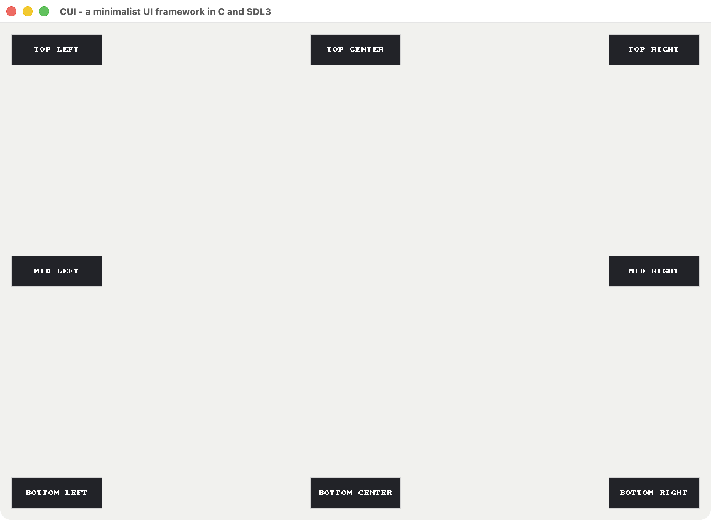

[](https://github.com/akurilin/cui/actions/workflows/ci.yml)
[](https://deepwiki.com/akurilin/cui)

# Project description

This project is focused on building a reusable UI kit in C using SDL3, currently targeting macOS. The sample app currently includes three pages:

- `todo` (`todo_page`): the primary sample application showing realistic widget composition and interactions.
- `corners` (`corners_page`): a resize/anchor validation page with eight edge/corner anchored buttons.
- `showcase` (`showcase_page`): a full widget showcase page that demonstrates every built-in UI element on one screen.

## Current UI

Captured on February 14, 2026 from the current TODO sample page:


Captured on February 18, 2026 from the corners page as a showcase of anchoring behavior when the window is resized:



SDL and SDL_image are brought in as Git submodules at `vendored/SDL` and
`vendored/SDL_image`.

## Architecture Overview

The codebase is split into:

- a reusable UI kit (`include/ui`, `src/ui`) for concrete widgets and shared element primitives,
- a UI system/runtime layer (`include/system`, `src/system`) for orchestration and dispatch,
- an example app layer (`include/pages`, `src/pages`) hosted by a small application shell (`main.c`).

- `main.c` is composition/root wiring only: parse startup flags, select a page by id, create window/renderer, initialize `ui_runtime`, create the active page, and run the main loop.
- `todo_page` is the sample TODO app and owns todo-specific model state plus screen-level UI composition.
- `corners_page` is a lightweight anchor test screen used to verify corner/edge placement during resize.
- `showcase_page` is a one-screen widget gallery used to validate and demo all built-in controls.
- `ui_runtime` is the lifecycle owner + dispatcher for all elements.
- `ui_element` is the common base interface for polymorphism in C.

### UI "Inheritance" Model (C-style)

There is no language-level inheritance in C, so this project uses struct embedding + a virtual function table:

- Every concrete widget embeds `ui_element base;` as its first field.
- Every concrete widget installs a `ui_element_ops` table (`handle_event`, optional `hit_test`,
  optional `can_focus`, optional `set_focus`, `update`, `render`, `destroy`).
- `ui_runtime` stores all widgets as `ui_element *` and calls the ops table, which gives runtime polymorphism similar to a base-class interface.

Inheritance chain in this project:

```text
ui_element (base type)
  -> ui_window
  -> ui_pane
  -> ui_button
  -> ui_checkbox
  -> ui_text
  -> ui_text_input
  -> ui_image
  -> ui_slider
  -> ui_segment_group
  -> ui_hrule
  -> ui_layout_container
  -> ui_scroll_view
  -> ui_fps_counter
```

### Layout & Sizing Model

The UI uses a **top-down width, bottom-up height** convention:

- **Width flows down**: parent elements push widths onto children by writing `child->rect.w`. A `ui_scroll_view` sets the `ui_layout_container`'s `x`/`w`, and the container in turn sets each child's `x`/`w`.
- **Height flows up**: children own their heights (`rect.h` is set at creation or during update). Parents read `child->rect.h` to position subsequent children and to auto-size their own `rect.h` to fit content.

`ui_layout_container` supports both **vertical** and **horizontal** stacking. In vertical mode, children are positioned top-to-bottom and the container stretches each child's width to fill; in horizontal mode, children are positioned left-to-right and the container stretches each child's height. For horizontal rows, right-aligned children keep `rect.x` as a right-edge inset instead of participating in left-flow x placement. Layout uses fixed 8 px padding and 8 px inter-child spacing.

Layout is still **imperative**, but it now has an explicit split between measurement and arrangement. Default element behavior remains fixed-size/fixed-rect (no-op measure, direct-rect arrange). `ui_layout_container` and `ui_scroll_view` opt into explicit measure/arrange passes, and `todo_page` runs page-level `measure_page_layout` + `arrange_page_layout` during create/resize/update and after row rebuilds.

Children track a **parent pointer and alignment anchors** for relative positioning. `ui_element_screen_rect()` resolves each element's window-space rectangle by walking the parent chain and applying horizontal/vertical anchor modes. This enables reliable anchoring (for example, bottom-right HUD elements) while preserving explicit ownership through container/context registration.

**The cascade in practice** (sidebar example): `ui_scroll_view` sets the container's `x`/`w` → `ui_layout_container` sets each child's `x`/`w` → container reads children's `h` to auto-size → scroll view reads the container's `h` to determine scroll bounds.

Key files:

- `include/pages/app_page.h`: generic page-ops interface plus build-generated page table declarations.
- `include/pages/corners_page.h`, `src/pages/corners_page.c`: resize-anchor test page with eight edge/corner-aligned buttons.
- `include/pages/showcase_page.h`, `src/pages/showcase_page.c`: all-widgets demo page with interactive controls inside a scrollable layout.
- `include/pages/todo_page.h`, `src/pages/todo_page.c`: todo page public lifecycle API + private page logic (task state, callbacks, and widget composition).
- `CMakeLists.txt` (page discovery): scans `src/pages/*_page.c` and generates `build/generated/page_index.c`, which exports `app_pages[]` for runtime page selection.
- `include/ui/ui_element.h`, `src/ui/ui_element.c`: base type, virtual ops contract, and shared border helpers.
- `include/system/ui_runtime.h`, `src/system/ui_runtime.c`: dynamic element list, ownership, event/update/render dispatch.
- `include/ui/ui_pane.h`, `src/ui/ui_pane.c`: rectangle fill + border visual group element.
- `include/ui/ui_button.h`, `src/ui/ui_button.c`: clickable element with press/release semantics and callback.
- `include/ui/ui_checkbox.h`, `src/ui/ui_checkbox.c`: labeled toggle control with boolean change callback.
- `include/ui/ui_text.h`, `src/ui/ui_text.c`: static debug-text element.
- `include/ui/ui_hrule.h`, `src/ui/ui_hrule.c`: thin horizontal divider line with configurable inset.
- `include/ui/ui_image.h`, `src/ui/ui_image.c`: image element with fallback texture behavior.
- `include/ui/ui_slider.h`, `src/ui/ui_slider.c`: horizontal slider with min/max range and value callback.
- `include/ui/ui_text_input.h`, `src/ui/ui_text_input.c`: single-line text field with ui_runtime-managed focus, keyboard input, and submit callback.
- `include/ui/ui_segment_group.h`, `src/ui/ui_segment_group.c`: segmented control (radio-button group) with selection callback.
- `include/ui/ui_layout_container.h`, `src/ui/ui_layout_container.c`: vertical/horizontal stack container with auto-sizing.
- `include/ui/ui_scroll_view.h`, `src/ui/ui_scroll_view.c`: scrollable viewport wrapper with mouse-wheel input and clip-rect rendering.
- `include/ui/ui_fps_counter.h`, `src/ui/ui_fps_counter.c`: self-updating FPS label anchored to viewport bottom-right.
- `include/ui/ui_window.h`, `src/ui/ui_window.c`: root tree element that owns child elements and forwards measure/arrange/event/update/render traversal.
- `include/util/fail_fast.h`, `src/util/fail_fast.c`: shared fail-fast logger/abort helper for unrecoverable internal errors.

### Frame/Lifecycle Flow

Per frame, `main.c` drives the UI system in this order:

1. Poll SDL events and forward each to `ui_runtime_handle_event`.
2. Call selected page `update()` for page-level per-frame work (for example, header clock refresh in `todo_page`).
3. Call `ui_runtime_update(delta_seconds)`.
4. Clear renderer and call `ui_runtime_render(renderer)`.
5. Present frame.

`ui_runtime` behavior rules:

- Dispatch `handle_event` only for `enabled` elements.
- Route text and keyboard events only to the currently focused element.
- Route pointer events by front-to-back hit testing and stop at first handler.
- Capture pointer interaction on left press and release capture on left release.
- Dispatch `update` only for `enabled` elements.
- Dispatch `render` only for `visible` elements.
- Destroy all registered elements via each element's `destroy` op during `ui_runtime_destroy`.

### Page Discovery & Startup Selection

- Page ids are derived from filenames using `src/pages/<id>_page.c`.
- CMake discovers all `*_page.c` files and generates `build/generated/page_index.c`.
- Each page exports `<id>_page_ops` (for example, `todo_page_ops`, `corners_page_ops`).
- `main.c` selects the startup page with `--page <id>`.
- `--help` prints the currently discovered page ids.

### Startup vs Resize Control Flow

These are two distinct flows in the current system.

#### 1) First launch: how elements get their initial size/position

1. `main.c` parses startup options (`--page`, `--width`, `--height`), resolves the page descriptor from build-generated `app_pages[]`, initializes SDL + window + renderer, initializes `ui_runtime`, then calls selected page `create(window, &context, width, height)`.
2. `todo_page_create` stores viewport dimensions and computes top-level geometry (content width, header widths, list height, footer positions).
3. Most top-level widgets are created with explicit rects derived from those computed values (header, input row, rules, list frame, footer, etc.).
4. The task list body is built as:
   - `ui_scroll_view` (viewport/clipping),
   - containing a vertical `ui_layout_container` (`rows_container`),
   - containing one horizontal `ui_layout_container` per task row.
5. Each task row creates leaf controls (number, checkbox, title, time, delete button) with fixed row/column dimensions.
6. `todo_page` registers a single `ui_window` root into `ui_runtime`; the root owns all page elements as children.
7. `todo_page` performs an explicit page layout pass (`measure_page_layout` + `arrange_page_layout`):
   - top-level panes/controls are measured/arranged from viewport-derived geometry,
   - the task-list `ui_scroll_view` is measured/arranged with the list viewport rect,
   - the scroll view recursively measures/arranges the rows `ui_layout_container` and each row container.
8. Absolute render/hit-test rects are resolved from parent-relative rects via parent chain + alignment anchors (`ui_element_screen_rect`).

In short: initial geometry is seeded by page code and then finalized through explicit page-level measure/arrange passes.

#### 2) Runtime resize: user drags window

1. SDL emits `SDL_EVENT_WINDOW_RESIZED`.
2. `main.c` handles it by:
   - updating renderer logical presentation to the new logical size,
   - calling selected page `resize(page_instance, new_w, new_h)`.
3. `todo_page_resize` (for the TODO page implementation) updates page viewport fields and runs `measure_page_layout` + `arrange_page_layout`.
4. Page arrange recomputes and writes top-level rects:
   - stretches/shifts header panes,
   - right-anchors add/filter controls,
   - resizes list frame + scroll view + rows container,
   - repositions footer elements,
   - updates window-root/fps anchoring dimensions.
5. Page update/runtime update continue with already-arranged rects for the new viewport.
6. `ui_runtime_render` then draws the updated layout for that frame.

In short: resize updates page-level geometry immediately through measure/arrange; containers no longer self-layout in event/update paths.

### Ownership Rules

- Element constructors (`ui_button_create`, `ui_pane_create`, etc.) allocate on the heap and return ownership to caller.
- After `ui_runtime_add` succeeds, ownership transfers to `ui_runtime`.
- Sample page lifecycle callbacks (`create`/`resize`/`update`/`destroy`) follow a fail-fast policy for unrecoverable internal failures and invalid internal state: they log a critical error and abort instead of returning recoverable errors.
- `todo_page_destroy` removes and destroys elements that were registered by the page, then frees page-owned task/model storage.

## Roadmap

This project intentionally stays minimal. The following capabilities are explicitly out of scope:

1. **Real text rendering** — Widgets currently use `SDL_RenderDebugText` (fixed 8x8 monospace glyphs), and we do not plan to add full font loading/rendering systems.
2. **Keyboard navigation and focus traversal** — Focus/capture routing exists in `ui_runtime`, but tab ordering, arrow-key traversal, and focus ring rendering are not planned.
3. **Styling and theming** — Widget colors/padding/spacing remain construction-time values; a shared theme/style inheritance system is not planned.

Potential future enhancements (still under consideration):

1. **Tree-aware propagation and overlay layers** — Event routing is hit-tested with focus/capture today, but explicit parent/child target paths, bubble/capture phases, and overlay layers could improve modals, dropdowns, tooltips, and context menus.
2. **Richer layout primitives** — Layout is currently vertical/horizontal stacking with fixed 8 px padding/spacing. Proportional/weighted sizing, min/max constraints, grid layout, alignment control, and configurable spacing may be added later.
3. **Dropdown/select control** — A segmented control exists today, but a true dropdown/select widget (button + popup list + overlay/z-order handling + outside-click dismissal) is still missing.
4. **Constraint-style responsive layout** — Anchors and stack stretching are implemented, but full responsive constraints (min/max sizing rules, percentage/fill policies, and window-relative pin/stretch behavior across arbitrary element trees) are not.
5. **Data-driven UI description (markup/DSL)** — UI is currently composed in C only. A simple declarative format (for example JSON/TOML/custom DSL) plus loader/binder would make screen iteration and reuse faster.
6. **Animation system with easing curves** — There is no built-in tween/animation layer yet. Adding time-based transitions (position, size, color, opacity) with reusable easing curves would improve interaction quality.
7. **Broader automated test coverage** — CTest currently runs a focused hierarchy test binary. Wider coverage is still needed for widget behavior, focus/input routing, layout/resize regressions, and integration-level page scenarios.
8. **Sample-page parity with TODO workflow coverage** — all core widgets are now demonstrated on the `showcase` page, but TODO-specific end-to-end scenarios (task-focused flows with richer widget combinations) can still be expanded.

## Configure and Build:
```
cmake -S . -B build
cmake --build build
```

## Makefile shortcuts:
```
make build    # configure + build
make test     # build + run CTest suite
make run      # build + run build/Debug/cui, build/Release/cui, or build/cui (use RUN_ARGS/ARGS for app flags)
make clean    # remove build directory
make format   # apply clang-format to non-vendored .c/.h files
make lint     # run clang-tidy checks
make analyze  # run Clang Static Analyzer for the cui target via scan-build
make precommit # run all commit-gating checks
make install-hooks # enable repo-managed Git hooks
make submodules-init   # initialize and fetch vendored submodules
make submodules-update # update submodules to latest remote commits
```

## Linting, Formatting, and Hooks:
This repository uses:

- `clang-format` for consistent formatting (`.clang-format`)
- `clang-tidy` for linting and static checks (`.clang-tidy`)
- `scan-build` for Clang Static Analyzer checks

Brace style policy: use Allman braces everywhere, meaning opening braces go on a new line for functions, control flow, and aggregate declarations.

To enforce checks before every commit:

```
make install-hooks
```

After that, Git will run `.githooks/pre-commit`, which executes `make precommit`.

On macOS, install required tools with Homebrew if needed:

```bash
brew install llvm
```

If Homebrew does not add LLVM binaries to your shell path automatically, add:

```bash
export PATH="/opt/homebrew/opt/llvm/bin:$PATH"
```

## Run:
The executable is generated under the build configuration directory. Depending
on your generator/configuration, run one of:

```
./build/Debug/cui
./build/Release/cui
./build/cui
```

Optional startup window size:

```
./build/cui --width <width> --height <height>
```

Optional startup page id (`<id>` is derived from `src/pages/<id>_page.c`):

```
./build/cui --page <id>
```

Example:

```
./build/cui --page todo -w 800 -h 600
```

Corners anchor test page:

```
./build/cui --page corners
```

Showcase page:

```
./build/cui --page showcase
```

Show command-line help:

```
./build/cui --help
```

Pass app args through `make run`:

```bash
make run RUN_ARGS="--page todo --width 800 --height 600"
```

`ARGS` is also supported as an alias:

```bash
make run ARGS="--page corners --width 1000 --height 700"
```

```bash
make run ARGS="--page showcase --width 1100 --height 760"
```

## Screenshot Capture (macOS)

Use the helper script to launch the app, wait for startup, and capture the app window:

```bash
scripts/capture_app_window.sh ./build/cui /tmp/cui-example.png
```

Pass app arguments (for example startup width/height) after `--`:

```bash
scripts/capture_app_window.sh ./build/cui /tmp/cui-example-800x600.png 2 -- --page todo --width 800 --height 600
```

## Submodule workflow

Use Makefile commands:

```bash
make submodules-init
make submodules-update
```
